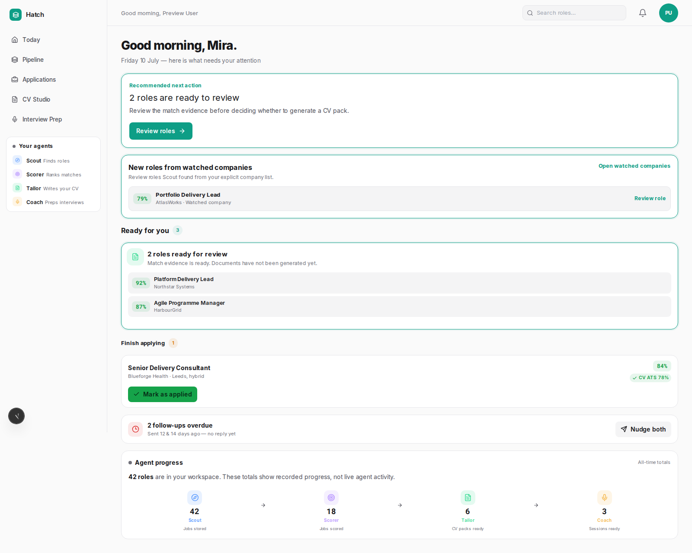
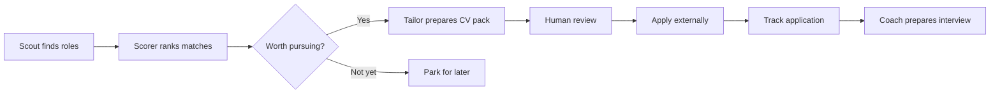
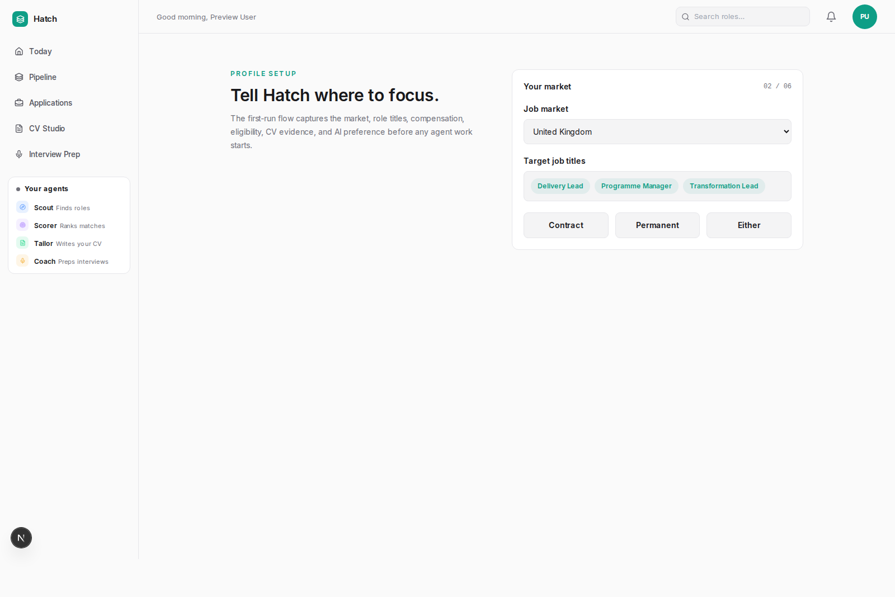
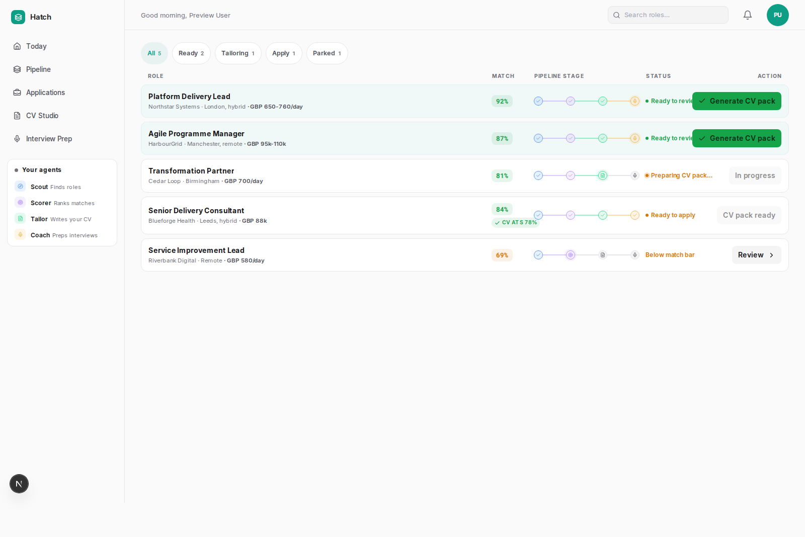
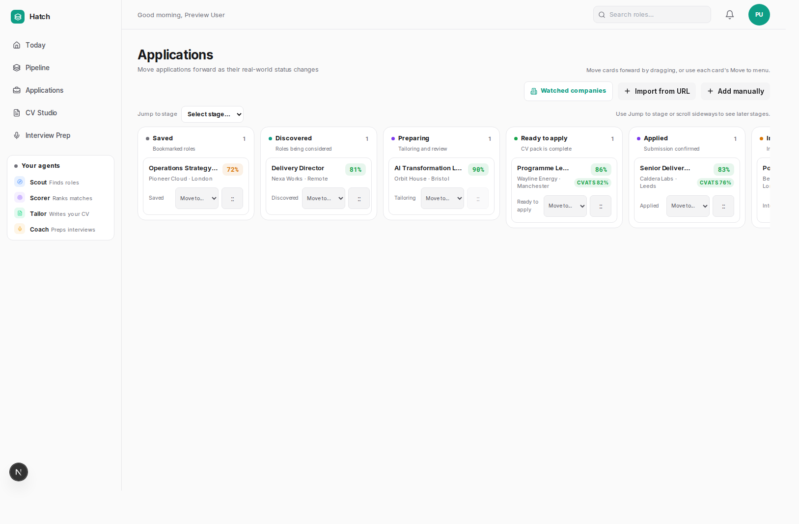
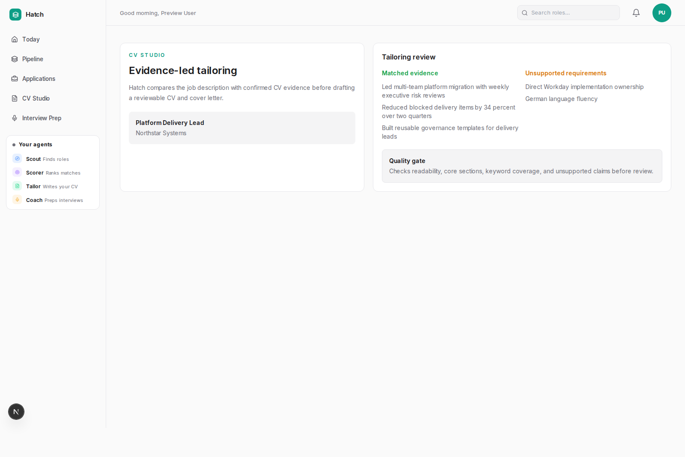
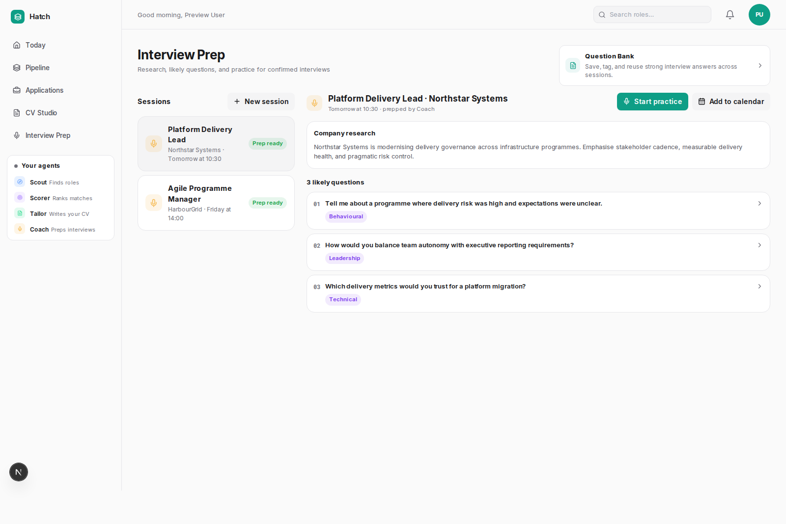

# Hatch

**A self-hosted, human-in-the-loop workspace for job search, applications, and interview preparation.**

Hatch helps you find roles, score them against your profile, prepare grounded curriculum vitae (CV) and cover-letter packs, track applications, and prepare for interviews. It runs on your machine, keeps your data local by default, and never submits an application without you.

<p align="center">
  
</p>

## Why Hatch

Job hunting turns into repeated admin: search boards, compare roles, adapt your CV, track each application, and prepare for interviews. Hatch automates the repeatable work while keeping every external action under your control.

- **Scout** discovers roles from enabled sources
- **Scorer** ranks roles against your profile and preferences
- **Tailor** prepares evidence-grounded CV and cover-letter packs
- **You review and apply** on the employer site
- **Coach** creates structured interview preparation



## Product walkthrough

This walkthrough follows the main Hatch workflow from first setup to interview preparation.

### Start with your profile

Onboarding captures your target market, role titles, compensation preferences, eligibility, skills, CV, artificial intelligence (AI) provider choice, and job-board preferences.

<p align="center">
  
</p>

### See what needs attention

**Today** prioritizes the next useful action. It highlights roles ready for review, recent agent activity, follow-ups, and preparation work.

<p align="center">
  
</p>

### Review roles before generation

**Pipeline** shows roles while Hatch discovers, scores, and prepares them. You review the match evidence before generating a CV pack.

<p align="center">
  
</p>

### Track the application journey

**Applications** tracks roles through the real application lifecycle:

`Saved -> Discovered -> Preparing -> Ready to apply -> Applied -> Interview -> Offered -> Accepted`

Cards can be moved by drag-and-drop or with the keyboard-accessible **Move to...** menu. Hatch blocks invalid backward transitions and uses explicit close actions for rejected, withdrawn, and declined outcomes.

<p align="center">
  
</p>

### Prepare an evidence-led CV pack

**CV Studio** compares the job description with your confirmed master CV, surfaces evidence, and generates a reviewable CV and cover letter. Hatch is designed not to invent experience.

<p align="center">
  
</p>

### Prepare for interviews

**Interview Prep** supports application-linked and manual sessions, reusable answers in the Question Bank, role-specific questions, model answers, calendar export, and practice workflows.

<p align="center">
  
</p>

## Key capabilities

Hatch combines job discovery, document tailoring, and application tracking in one local workspace:

| Area | What Hatch includes |
|---|---|
| Discovery | Scheduled job discovery, deduplication, company watchlists, and public job URL import |
| Matching | Profile-based scoring, shortlist thresholds, evidence, and rationale |
| CV Studio | Master-CV management, ATS-safe DOCX templates, tailoring review, quality gates, and document history |
| Applications | Kanban lifecycle, manual entries, follow-ups, outcomes, and interview hand-off |
| Interview Prep | Company research, likely questions, Question Bank, model answers, voice practice, and optional advanced coaching |
| AI choice | Start without AI, use bundled local `llama.cpp` services, or configure a supported cloud provider |
| Privacy | Self-hosted data, local app lock, protected product APIs, and host-managed provider secrets |

## Install Hatch

Hatch uses Docker Compose for the application stack. The installer starts the lightweight profile and lets you configure AI later.

### Windows — recommended

1. Confirm Docker Desktop can run Linux containers on your machine.
2. Download `install-hatch.cmd` from this repository.
3. Double-click it.
4. Follow the readiness report.
5. Open <http://localhost:3000>.

The Windows installer supports Windows PowerShell 5.1 and PowerShell 7, so most users do not need to install PowerShell separately. It checks Docker Desktop, WSL 2 readiness, Docker Compose, Git, Python, ports, disk space, network access, and existing Hatch state before changing the machine.

Run a non-mutating check from a terminal with:

```powershell
.\install-hatch.cmd -CheckOnly
```

For Docker/WSL recovery steps and diagnostic output, read the [Windows install guide](docs/getting-started/WINDOWS_INSTALL.md).

### Linux and macOS

```bash
curl -fsSL https://raw.githubusercontent.com/arvindsoni2/hatch/main/install.sh | bash
```

### Windows — advanced terminal install

```powershell
iwr https://raw.githubusercontent.com/arvindsoni2/hatch/main/install.ps1 | iex
```

Local script examples:

```powershell
.\install-hatch.cmd -InstallDir "D:\Apps\Hatch"
.\install-hatch.cmd -Mode cloud -BackendProfile core
.\install-hatch.cmd -CheckOnly -Json
.\install-hatch.cmd -Resume
.\install.ps1 -Mode advanced -BackendProfile full
```

Open <http://localhost:3000>, create the local app-lock password, and complete onboarding.

Common host commands:

```bash
hatch status
hatch doctor
hatch probe
hatch models list
hatch models install
hatch apply-ai-config
hatch capabilities status
hatch capabilities enable browser
hatch capabilities enable local-embeddings
hatch capabilities enable full
hatch capabilities disable
```

Linux/macOS advanced capability example:

```bash
./install.sh --mode advanced --backend-profile full
```

For manual Docker setup, capability profiles, troubleshooting, reset commands, and development checks, read the [Hatch operations guide](docs/operations/OPERATIONS.md).

## AI options

Hatch can start with AI configuration deferred. Profile editing, manual application tracking, settings, and job entry remain available until you configure a provider.

### Local AI

The local developer stack supports two `llama.cpp` services:

| Service | Default model | Port | Main purpose |
|---|---|---:|---|
| `llm-primary` | Qwen3.5-4B Q4_K_M | 8080 | Detailed scoring, CV packs, and Coach |
| `llm-triage` | Qwen3.5-0.8B Q8_0 | 8081 | Fast relevance filtering |

Managed downloads require confirmation and SHA-256 verification. Model services bind to localhost.

### Cloud AI

Cloud providers are optional. Easy-install secrets stay outside the browser and repository:

```bash
hatch secrets set openai
hatch secrets status
hatch secrets unset openai
```

## Privacy and safety

Hatch is designed around a strict trust boundary:

- Hatch never submits applications automatically
- Generated documents require human review
- App lock protects the workspace and product APIs
- Sessions use an HttpOnly cookie and expire server-side
- Personal files, databases, generated documents, recordings, and models under `data/` are gitignored
- Cloud AI is used only after you configure a provider
- DOCX remains the source of truth for generated CVs

To reset a forgotten database-backed app-lock password without deleting job data:

```bash
bash scripts/reset-app-lock.sh
```

## Documentation

See the [Hatch documentation index](docs/README.md) for current user, operations, architecture, development, and historical documentation.

- Installation: [docs/getting-started/INSTALLATION.md](docs/getting-started/INSTALLATION.md)
- Architecture: [docs/architecture/OVERVIEW.md](docs/architecture/OVERVIEW.md)
- Operations: [docs/operations/OPERATIONS.md](docs/operations/OPERATIONS.md)
- Contributing: [CONTRIBUTING.md](CONTRIBUTING.md)
- Security: [SECURITY.md](SECURITY.md)

## Repository structure

The repository is split by application surface and operational responsibility:

```text
backend/        FastAPI services, agents, persistence, and document workflows
frontend/       Next.js application, Vitest tests, and Playwright tests
data/           Local profile, database, documents, and model state
locales/        Market-specific configuration
scripts/        Installation, maintenance, model, and recovery scripts
docs/           Product, architecture, feature, and operations documentation
```

## Current boundaries

These constraints are intentional for the current release:

- Hatch does not auto-apply or automate recruiter messaging
- Job-board reliability depends on public access, site changes, rate limits, and enabled capabilities
- Browser CV preview is approximate because DOCX is the document source of truth
- Local model quality and speed depend on the machine and model selected
- PDF export stays capability-gated and unavailable unless a safe converter is configured

## Development

Start with the operations guide, then use the project checks that match your change:

```bash
make help
make test
make lint
docker compose config --quiet
```

Frontend checks:

```bash
cd frontend
npm ci
npm run type-check
npm test
npm run test:e2e
```

Backend checks:

```bash
cd backend
python -m pytest
```

## Contributing

Issues and focused pull requests are welcome. Changes should preserve the core Hatch boundary: the system may assist, prepare, and recommend, but you approve every external action.

## Release Notes And Governance

- License: [MIT](LICENSE)
- Changes: [CHANGELOG.md](CHANGELOG.md)
- Contributing guide: [CONTRIBUTING.md](CONTRIBUTING.md)
- Security reporting: [SECURITY.md](SECURITY.md)
- Release checklist: [docs/operations/RELEASE_CHECKLIST.md](docs/operations/RELEASE_CHECKLIST.md)
- Operational details: [docs/operations/OPERATIONS.md](docs/operations/OPERATIONS.md)
