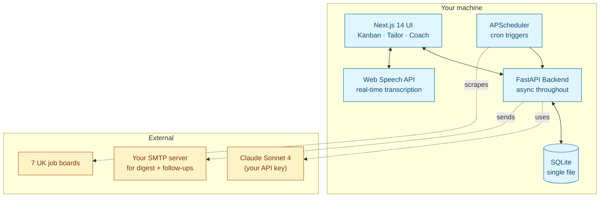

<!-- markdownlint-disable MD033 MD041 -->

<div align="center">

# JobPilot

**Self-hosted, AI-powered job search operations for the UK contract market.**

Scout listings across 7 UK job boards · Track applications on a Kanban pipeline · Auto-tailor CVs and cover letters with Claude · Prep for interviews with AI coaching · Run entirely on your own machine.

[](./LICENSE)
[](https://github.com/arvindsoni2/jobpilot/actions/workflows/ci.yml)
[](https://www.python.org/downloads/)
[](https://nextjs.org/)
[](https://www.anthropic.com/)
[](https://docs.docker.com/compose/)

[Quick Start](#quick-start) · [Architecture](#architecture) · [Modules](#modules) · [How JobPilot differs from career-ops](#how-jobpilot-differs-from-career-ops) · [FAQ](#faq)

</div>

---

## Why JobPilot

Job hunting at 20+ years of experience is a full-time operations problem. You have dozens of active applications across multiple boards, each with its own tracker, some with tailored CVs, some waiting on follow-ups, some where the role has quietly disappeared from the site. Spreadsheets rot. Browser tabs multiply. Recruiter chains fragment across LinkedIn, email, and WhatsApp.

JobPilot is the system I wanted — a self-hosted operations platform that scouts, tracks, tailors, and coaches through a single web UI, running locally with Docker Compose. Your data stays on your machine. The only external call is to the Claude API, with your key, billed to you.

It's built for a specific kind of user — **UK-based Solutions Architects, Delivery Leads, Product Owners, and senior engineers navigating the post-IR35 contract market** — but the core patterns (scrape → classify → track → tailor → coach) generalise cleanly.

## Quick Start

```bash
git clone https://github.com/arvindsoni2/jobpilot.git
cd jobpilot
cp .env.example .env         # Add your ANTHROPIC_API_KEY
make doctor                  # Validates prerequisites
make docker-up               # Starts backend (:8000) and frontend (:3000)
```

Open [http://localhost:3000](http://localhost:3000). First scrape runs automatically; classification follows. Within 15 minutes you'll have hundreds of scored, deduplicated listings in your pipeline.

See [docs/SETUP.md](./docs/SETUP.md) for the detailed walkthrough.

## Modules

JobPilot is built as four independent modules plus cross-cutting smart features. Each module is usable on its own.

| Module | What it does |
|---|---|
| **Scout** | Async scrapers for 7 UK job boards (ContractorUK, JobServe, Reed, CWJobs, ITJobsWatch, LinkedIn, Adzuna). Fuzzy dedup across sources. APScheduler runs quick (3h) and full (8h) cycles. AI batch classifier scores every job 0–100 on skill overlap, seniority fit, sector relevance, rate alignment, and location match. |
| **Tracker** | Kanban pipeline for applications with a strict state machine (discovered → shortlisted → applied → interview → offered → accepted). Interview rounds, recruiter contacts, follow-ups, and activity log per application. Analytics dashboard with funnel metrics, response rates, and weekly trends. |
| **Tailor** | Three-stage Claude pipeline: JD analysis → CV rewrite → cover letter generation. ATS scoring across keyword match, phrase match, section relevance, and format compliance. Full document versioning with diff view. Outputs .docx via a custom template engine. |
| **Coach** | Company research, question generation across 6 weighted categories (technical, behavioural, situational, domain, culture, commercial), real-time STT with filler-word detection, STAR-rubric evaluation, optional video analysis via TensorFlow.js. New in v2.1: [**Interview Story Bank**](#interview-story-bank) — your 5–10 master STAR stories, auto-extracted from practice sessions and retrieved during live mock interviews. |

### Smart features (cross-module)

- **Ghost Job Detector** — Pure algorithmic 0–100 score per posting across six weighted signals (repost frequency, posting age, vague description, agency spam, missing rate/company, no-response history). Four verdicts: likely_real, uncertain, suspicious, likely_ghost. Suspected ghosts are hidden from default listings.
- **Follow-up Email Automation** — Claude-drafted post-application, thank-you, and re-engagement emails with human review required. Rate-limited, domain-throttled, spam-safe.
- **Daily Digest** — One email, 07:00 local, summarising new high-match jobs, overdue follow-ups, upcoming interviews, and pipeline stats.

## Architecture



### Design principles

- **Async everywhere.** Scrapers, Claude calls, and DB access all use async/await. One event loop, no thread pool juggling.
- **Repository pattern.** All DB access goes through repository classes. Services contain business logic. Routes are thin wrappers. Easy to mock, easy to test.
- **Factory pattern for scrapers.** Each board = one class inheriting `BaseScraper`. Adding a new board is 1 file + 1 test fixture + 1 registration.
- **Fail gracefully.** Scrapers log errors and continue; the scheduler never crashes. The classifier is idempotent; retriable on any failure.
- **SQLite on purpose.** Zero-config, portable, backed up by copying a file. For single-user self-hosted tools, Postgres is premature optimisation.

### Tech stack

**Backend:** Python 3.12 · FastAPI · SQLAlchemy 2.0 (async) · Alembic · Pydantic v2 · Playwright · BeautifulSoup4 · httpx · APScheduler · aiosmtplib · sentence-transformers

**Frontend:** Next.js 14 (App Router) · TypeScript (strict) · Tailwind CSS · shadcn/ui · TensorFlow.js (face-mesh for video coaching)

**AI:** Claude Sonnet 4 via the `anthropic` Python SDK with structured JSON mode

**Deployment:** Docker Compose, local only

## How JobPilot differs from career-ops

If you're evaluating job search tooling, you'll inevitably find [**santifer/career-ops**](https://github.com/santifer/career-ops) — a well-built, well-loved AI job search system (35k+ stars at time of writing). It's excellent. It's also solving a different shape of the problem.

I looked at career-ops before writing JobPilot v2, and deliberately chose a different architectural bet. Neither is universally better — pick the one that matches how you work.

| Dimension | **JobPilot** | **career-ops** |
|---|---|---|
| **Runtime** | FastAPI web app + Next.js UI | Claude Code CLI + markdown skill modes |
| **Data store** | SQLite + SQLAlchemy ORM | Markdown + YAML + TSV files |
| **UI** | Browser (Kanban, dashboards, forms) | Terminal (Go Bubble Tea TUI) |
| **Setup** | `docker compose up` → web UI | `git clone && npm install && claude` |
| **Interview prep** | Live mock with STT + video + Story Bank | Static STAR+R templates per session |
| **Market focus** | UK contract / outside IR35 / Reed + CWJobs + ContractorUK | US-centric: Anthropic, OpenAI, Ashby, Greenhouse |
| **Rate tracking** | Daily/hourly rates, IR35 status, agency tagging | Salary only |
| **Works best when** | You want a real web app with persistent state and a Kanban view | You already live in Claude Code and prefer files over databases |

**Ideas I learned from career-ops and ported (with acknowledgement):**
- Interview Story Bank concept — implemented as a first-class database-backed feature with auto-extraction and semantic matching
- Weighted multi-dimensional job scoring — implemented as explicit `MatchScorer` with transparent breakdown
- Archetype detection before evaluation — implemented across 9 role types matching UK job titles
- "The system doesn't know you yet" onboarding framing — stolen wholesale because it's honest and correct

If you're US-based, CLI-native, and targeting AI labs, use career-ops — it's purpose-built for that flow. If you're UK-based, want a web UI with a Kanban pipeline, and care about IR35 status and ghost-job filtering, JobPilot will fit you better.

## Interview Story Bank

*(New in v2.1)*

Behavioural interviews recycle the same 20 questions in different wording. Strong candidates don't answer 20 questions — they tell 5–10 well-rehearsed stories, reframed per question.

The Story Bank captures those stories once and retrieves them in three ways:

1. **Auto-extracted** from your Coach session answers when STAR structure ≥ 7/10 and impact ≥ 6/10
2. **Manually curated** via the Story Bank UI — add stories you want to tell but haven't practised yet
3. **Retrieved live** during mock interviews — pre-answer hint (off by default) and post-answer reflection showing which bank story would have fit best

Matching is a two-stage pipeline: fast tag-overlap (Jaccard similarity), falling back to sentence-transformer embeddings. Embeddings run locally on CPU via `all-MiniLM-L6-v2` — no API calls at match time, zero marginal cost.

See [docs/story-bank.md](./docs/story-bank.md) for the full design.

## Repository Structure

```
jobpilot/
├── backend/                  # Python 3.12 FastAPI
│   ├── app/
│   │   ├── models/           # SQLAlchemy ORM (async)
│   │   ├── schemas/          # Pydantic v2 request/response
│   │   ├── scrapers/         # One file per board, BaseScraper pattern
│   │   ├── services/         # Business logic, Claude orchestration
│   │   ├── repositories/     # DB access layer
│   │   ├── routers/          # FastAPI endpoints
│   │   ├── prompts/          # Jinja2 templates for Claude calls
│   │   └── templates/        # CV/CL docx templates, email HTML
│   ├── alembic/              # DB migrations
│   └── tests/                # pytest, 130+ tests, 85% coverage
├── frontend/                 # Next.js 14 App Router, TS strict
│   └── src/
│       ├── app/              # Pages (server components)
│       ├── components/       # Client components, organised by module
│       └── lib/              # API client, utilities
├── docs/
│   ├── SETUP.md
│   ├── ARCHITECTURE.md
│   ├── decisions/            # ADRs
│   └── modules/              # Per-module deep-dives
├── examples/                 # Fictional persona sample data
├── docker-compose.yml
├── Makefile                  # All common commands
└── CLAUDE.md                 # Claude Code project config
```

## Commands

```bash
make dev              # Full stack with hot reload
make doctor           # Validate prerequisites, API keys, disk, ports
make scrape           # Run all scrapers once
make scrape-one BOARD=contractoruk
make classify         # AI classifier on pending jobs
make test             # Full test suite
make lint             # ruff + eslint
make docker-up        # Production-like local stack
make digest-preview   # Render tomorrow's digest email in browser
make ghost-stats      # Ghost-job verdict breakdown
make story-export     # Export your Story Bank to JSON
```

## FAQ

**Does JobPilot auto-submit applications?**
No. The public JobPilot does not include auto-apply. The Terms of Service for every major UK job board prohibit automated form submission, and open-sourcing that capability is a line I won't cross. JobPilot ends at "your CV and cover letter are ready — here's the apply link."

**Is scraping legal?**
Scraping public job listings for personal use sits in a grey zone that varies by jurisdiction and board ToS. JobPilot scrapers are conservative — randomised 2–8 second delays, rotating User-Agents, single-user request volumes. You are responsible for your use. See [LEGAL.md](./LEGAL.md).

**What does it cost to run?**
Zero infrastructure cost — it runs on your laptop. Your only spend is Claude API usage. A typical week (200 jobs classified, 5 CVs tailored, 3 Coach sessions) costs roughly £1–3 at current Sonnet 4 prices. Bring your own key, set your own monthly limits in the Anthropic console.

**Why not Postgres?**
Because this is a single-user tool and Postgres is a distributed system. SQLite with WAL mode handles the JobPilot workload comfortably. Backup is `cp jobpilot.db jobpilot.db.backup`. If you want Postgres, the SQLAlchemy 2.0 async layer makes swapping engines a 10-line change — but you probably don't need to.

**Why Apache 2.0 and not MIT?**
Apache 2.0 includes an explicit patent grant and a clearer contribution clause. Both are fine for this project; Apache reads as more enterprise-ready. The practical difference for you as a user is zero.

**Can I use this if I'm not in the UK?**
The Tracker, Tailor, Coach, Ghost Detector, and Follow-up email modules are market-agnostic — they'll work anywhere. The Scout module (scrapers) is UK-specific. Writing a US/EU scraper is one file inheriting `BaseScraper`; see [docs/adding-a-scraper.md](./docs/adding-a-scraper.md).

**Is there a hosted version?**
No. JobPilot is self-hosted on purpose. A hosted version would require storing your CV, applications, and interview recordings — which I'm not willing to do for a side project, and which you probably shouldn't want either.

## Contributing

This is primarily a personal tool that I've open-sourced. I welcome issues and PRs, but please read [CONTRIBUTING.md](./CONTRIBUTING.md) first — especially the scope section. JobPilot is not trying to become everything for everyone.

Good contributions: bug fixes, new scrapers (especially non-UK), test coverage, documentation improvements, security disclosures (see [SECURITY.md](./SECURITY.md)).

Out of scope: auto-apply, LinkedIn automation beyond RSS, anything that violates a job board's ToS, anything that requires a hosted component.

## Acknowledgements

- [**santifer/career-ops**](https://github.com/santifer/career-ops) — prior art in this space; the Story Bank and archetype detection concepts in JobPilot are inspired by Santiago's work.
- [**Anthropic**](https://www.anthropic.com/) — Claude Sonnet 4 does the heavy lifting for JD analysis, CV tailoring, question generation, and answer evaluation.
- **Claude Code** — I used Claude Code to implement large portions of JobPilot. The `CLAUDE.md` at the repo root is the handoff spec it reads.

## License

[Apache License 2.0](./LICENSE). See [NOTICE](./NOTICE) for attributions.

## About the author

I'm Arvind — Technical Delivery Lead with 20+ years across energy, financial services, and aviation (TCS, Natoora, Hexaware). PMP, PMI-ACP, PSM-1, PSPO-1, working through AWS. Based in Newcastle upon Tyne, UK. I built JobPilot for my own job hunt; it's now open because someone else might save themselves the spreadsheet sprawl.

[Portfolio](https://arvind-portfolio-iota.vercel.app) · [GitHub](https://github.com/arvindsoni2) · [LinkedIn](https://linkedin.com/in/arvindsoni-pm)
