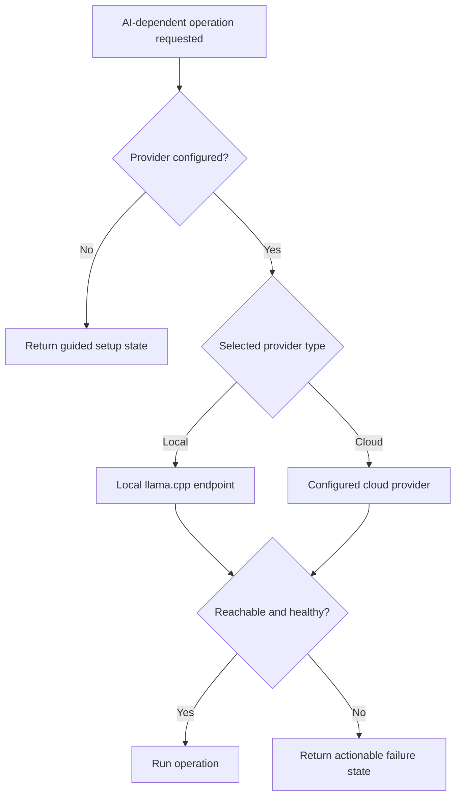

# AI Architecture

## Deferred Setup Mode

Hatch supports `not_configured` / AI-deferred mode. In this state the workspace remains usable for profile editing, settings, tracking, and manual workflow management.

## Local AI Mode

Local AI uses `llama.cpp` services started through `docker-compose.local-ai.yml`. The primary and triage services are configured separately and mount models from `${HATCH_HOME}/models` in easy installs or `./data/models` in the developer stack.

## Cloud Provider Mode

Cloud mode depends on host-managed secrets and a configured provider. The browser and backend do not collect provider API keys in the current setup flow.

## Primary Versus Triage

- Primary local model: detailed scoring, tailoring, and coach-heavy work
- Triage local model: lighter and faster relevance filtering

## Hardware Probe And Recommendations

`hatch probe` records a host-side hardware snapshot under `${HATCH_HOME}/probe` and `${HATCH_HOME}/config/hardware_probe_latest.json`. Setup endpoints use that snapshot to recommend local AI or cloud/deferred fallbacks.

## Model Catalogue And Installation

The model catalogue lives at `backend/app/config/model_catalog.json`. `hatch models list` and `hatch models install` are the current host flows for viewing and downloading supported models.

## Provider Selection

Current UI-supported provider choices are:

- Google Gemini
- OpenRouter
- OpenAI
- Anthropic

## Reachability And Health Checks

The setup flow exposes provider tests and local hardware/runtime status. Local model services also expose health endpoints on `:8080` and `:8081`.

## Secret Management

Easy installs keep provider secrets in `${HATCH_HOME}/config/secrets.env`. That file is written by the host CLI, not by the browser.

## Fallback And Degraded Behavior

- No provider configured: guided setup state
- Local models missing: setup remains incomplete
- Cloud secret missing: actionable host command is returned
- Optional capability absent: affected feature remains unavailable rather than silently half-working

## Capability-Gated AI Features

The backend profile controls optional browser automation, local embeddings, perception, and advanced coach capabilities independently from the chosen AI runtime.

## External Data Disclosure

Cloud providers receive data only when configured and used for an operation. Local AI keeps prompts inside the local workspace.

## AI Routing

## Related Guides

- [Local models](../operations/LOCAL_MODELS.md)
- [Cloud providers](../operations/CLOUD_PROVIDERS.md)
- [Troubleshooting](../getting-started/TROUBLESHOOTING.md)
