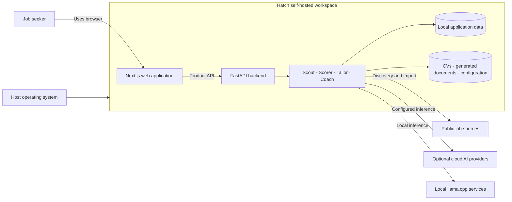
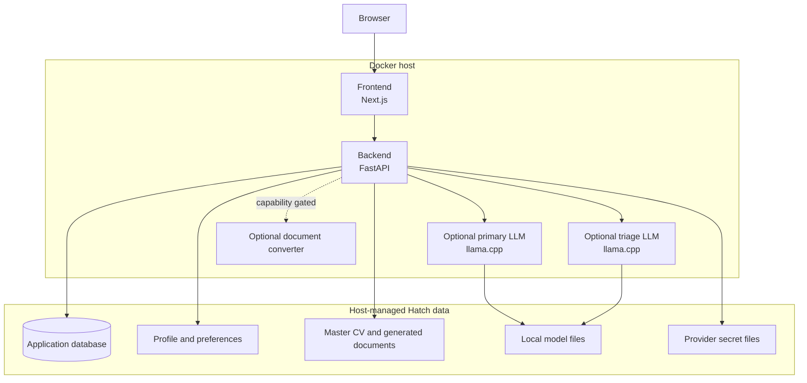

# Architecture Overview

Hatch is a self-hosted, single-user workspace for job discovery, application preparation, tracking, and interview preparation. The current implementation is a Next.js frontend backed by a FastAPI API, SQLite-backed local state, optional local `llama.cpp` services, and optional cloud AI providers.

## Product Principles

- Local-first by default
- Human approval before external action
- AI is optional and capability gated
- Host-owned secrets stay outside the browser
- DOCX remains the generated CV source of truth

## Trust And Human Control

Hatch may discover, score, generate, and recommend. It does not autonomously submit applications or contact recruiters. Human review is required before external action.

## System Context

## Runtime Containers

The default developer stack uses `docker-compose.yml`. Easy installs use `docker-compose.easy.yml` and add `docker-compose.local-ai.yml` only when local runtime AI is selected.

## Frontend

The frontend lives under `frontend/src/app` and exposes the current workflow surfaces:

- Today
- Jobs
- Pipeline
- Applications
- CV Studio
- Interview Prep
- Settings
- Onboarding and unlock

## Backend

The backend lives under `backend/app` and exposes API routers for setup, profile, jobs, applications, tailoring, coaching, analytics, watchlist, question bank, app lock, and diagnostics.

## Agent Responsibilities

- Scout: discovery and import
- Scorer: match evaluation and shortlist decisions
- Tailor: CV and cover-letter generation
- Coach: interview preparation, question generation, and follow-up practice

## Data And Storage

See [Data and storage](DATA_AND_STORAGE.md) for exact locations and lifecycle rules.

## AI Provider Architecture

AI can be deferred, local, or cloud-backed. See [AI architecture](AI_ARCHITECTURE.md).

## Capability Profiles

Backend capability profiles currently resolve to `core`, `browser`, `local-embeddings`, or `full`. The active profile controls optional backend dependencies and Compose overlays.

## Deployment Model

Hatch is designed for local Docker Compose deployment, not Kubernetes or multi-user SaaS hosting. See [Deployment](DEPLOYMENT.md).

## Failure And Degraded Operation

Important degraded modes include:

- app usable with AI deferred
- scraping reduced when optional browser capability is absent
- semantic scoring reduced when local embeddings are absent
- PDF export unavailable when the converter path is not configured

## Observability

The current repo provides Docker logs, backend health checks, CLI `status` and `doctor`, setup status endpoints, and developer-facing diagnostics routes.

## Related Documents

- [Components](COMPONENTS.md)
- [Workflows](WORKFLOWS.md)
- [AI architecture](AI_ARCHITECTURE.md)
- [Security and privacy](SECURITY_AND_PRIVACY.md)
- [Deployment](DEPLOYMENT.md)
