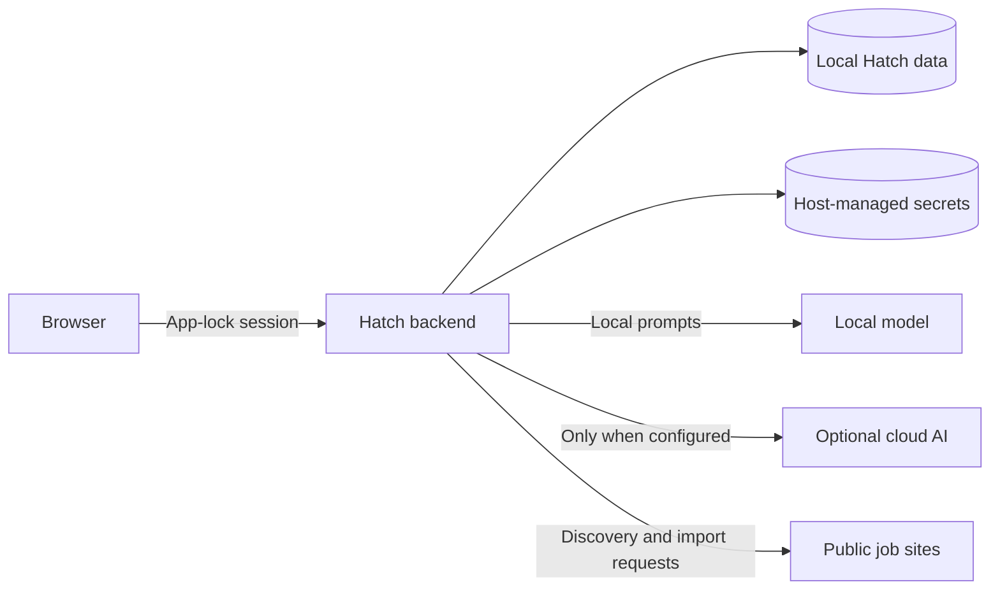

# Security And Privacy

This document explains the current product security and privacy posture. It does not replace the repository-level [SECURITY.md](../../SECURITY.md).

## Threat Model Scope

Hatch is a self-hosted, single-user local workspace. The current threat model focuses on protecting local job-search data, keeping provider secrets host-managed, and preventing accidental external action without user review.

## App Lock

App lock protects access to the local workspace through a dedicated setup, unlock, and session flow. It is not a cloud account system and it does not provide email recovery.

## Browser And Backend Boundary

The browser can store local draft state and send product actions to the backend, but provider secrets are not entered through the UI in the current easy-install flow.

## Session Handling

The product uses a backend-managed unlock/session model. The frontend exposes unlock and security settings pages, while the backend remains authoritative for protected API access.

## Local Data Storage

Application, profile, and generated-document data remain local in `data/` plus `${HATCH_HOME}` for easy-install state.

## Provider Secrets

Easy-install provider secrets live in `${HATCH_HOME}/config/secrets.env` and are managed by the host CLI.

## Local-Model Privacy

When local AI is selected, prompts stay within the local Hatch workspace and `llama.cpp` services running on the same machine.

## Cloud Provider Disclosure

Cloud providers receive data only when a provider is configured and an AI-backed action uses it.

## Job Source Interaction

Discovery and import requests go from the backend to public job sources. Hatch does not hide that network interaction.

## CV And Document Sensitivity

Master CV files, generated CVs, cover letters, and interview materials should be treated as sensitive personal data.

## Logs And Diagnostics

Docker logs, host logs, and diagnostic outputs may contain operational details. Review them before sharing publicly.

## Backup And Deletion

Backups should include `data/` and `${HATCH_HOME}/config/` when preserving a workspace. Reset and uninstall flows are intentionally narrower than “delete everything.”

## Data Boundary

## Non-Goals

- No implied multi-user SaaS isolation model
- No claim that every prompt is always local
- No autonomous external application submission

## Vulnerability Reporting

Use [SECURITY.md](../../SECURITY.md) for reporting guidance.
