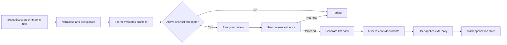
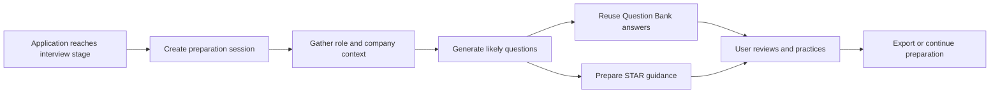
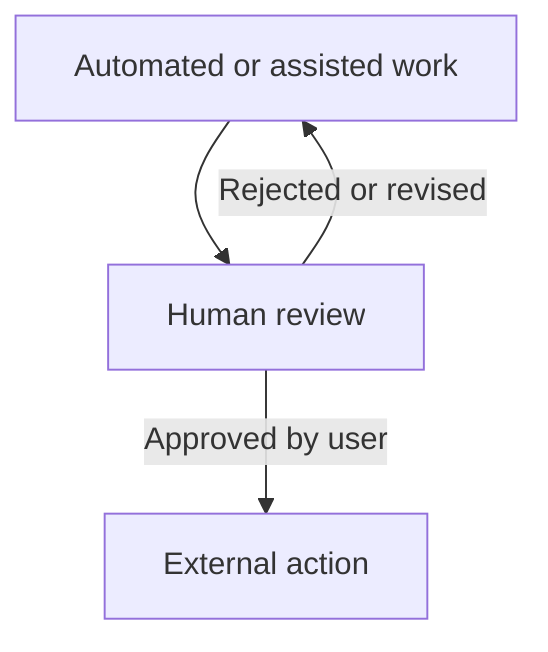

# Workflows

## Onboarding

Onboarding collects the search profile, stores a local workspace profile, and records non-secret AI/setup intent. The app-lock password is handled separately through the protected setup flow.

## Discovery To Application

## Interview Preparation

## Human-Control Boundary

Hatch may discover, score, generate, and recommend. It does not autonomously submit applications or contact recruiters.

## Application Tracking

Applications move through current product states such as saved, discovered, preparing, ready to apply, applied, interview, and offered. Some closed outcomes are explicit end states rather than drag targets.

## Company Watchlist

The watchlist lives under Applications and supports saved companies plus manual scans. Discovered roles from watched companies feed back into the broader workflow rather than creating a separate top-level product area.

## AI Setup And Provider Selection

Setup captures non-secret intent in the app, while the host CLI writes provider secrets and effective runtime configuration.

## Reset And Restart

The repo includes a local data reset flow, a separate app-lock reset flow, and a non-destructive uninstall by default. These are documented in operations and storage docs rather than hidden in implementation notes.
