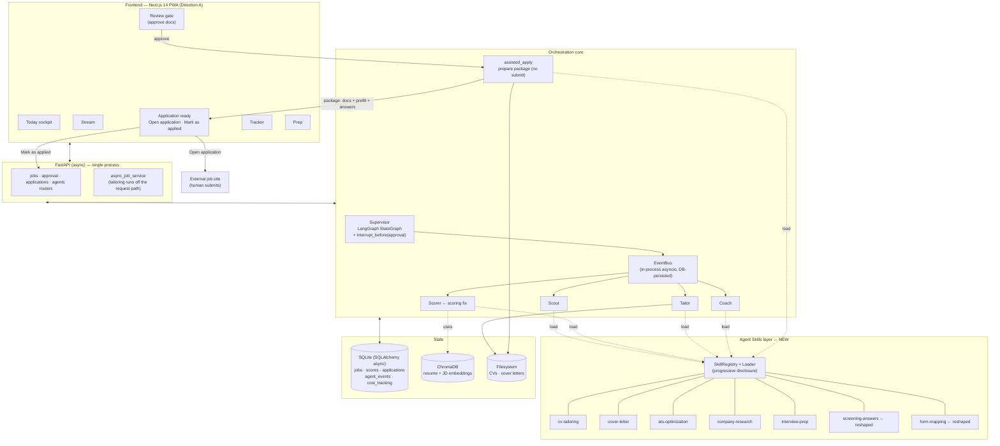
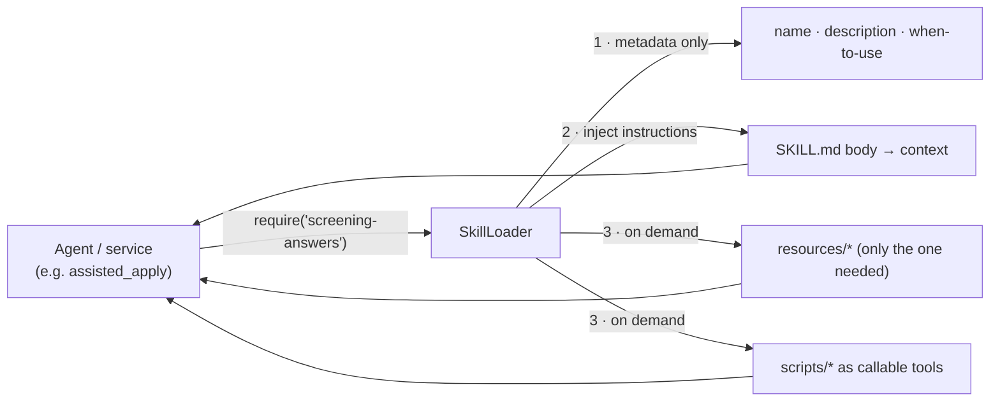
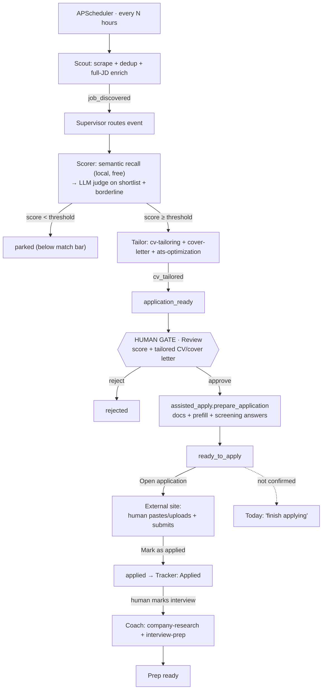
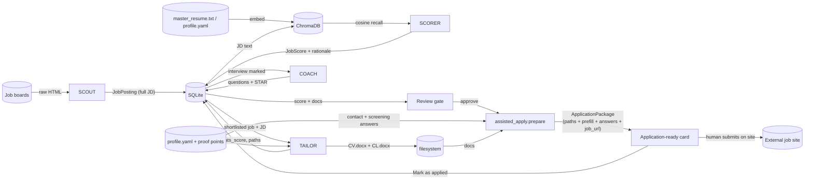
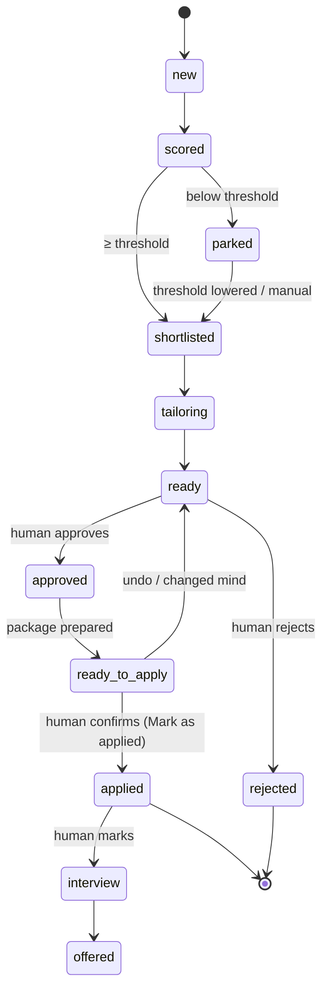

> [!WARNING]
> This document is retained for historical context. It does not describe the current Hatch implementation on `main`.

# Hatch v4 — Assisted Apply + Agent Skills (chosen direction)

**Architecture handoff for Claude Code**
**Date:** 6 June 2026
**Repo:** https://github.com/arvindsoni2/hatch
**Authors:** Senior Architecture review
**Status:** Design only — no code here. TDD-first on implementation.
**Supersedes:** `08_Architecture_Hatch_v4_Autonomous_Apply.md` (the autonomous-submission exploration). That document's Applier agent, channel adapters, Apply Worker, durable submission queue, stored job-board credentials, and the L0–L3 autonomy dial are **dropped**. This is the chosen, narrower direction.

---

## 0. What changed, and why this is the right shape

The previous draft designed autonomous external submission. We're not building that. The flow we're building is the one you drew:

```
Scout → emit job_discovered → Supervisor → Scorer (semantic recall + LLM judge on shortlist)
  → score ≥ threshold → Tailor (CV + cover letter + ATS gate) → application_ready
  → ┌ HUMAN CHECKPOINT: review docs, Approve ┐ → prepare package → human opens external link & submits
  └ (human gets interview call) → Human marks interview → Coach (research + questions + STAR)
```

**This is not a compromise — it is your original "assisted apply, the human always clicks submit" principle, restored.** That reframing matters for three concrete reasons:

1. **Nothing in the codebase has to be unwound.** `assisted_apply.py` stays as-is. `test_no_autonomous_submission` stays green. The `CLAUDE.md` rule "no `auto_apply` router exists" stays true. We stop fighting our own guardrails.
2. **It deletes ~90% of the new risk for almost no lost value.** Gone: ToS exposure, account/IP-ban risk, the CAPTCHA arms race, irreversible misfires, headless-browser flakiness, a separate worker process, and storing job-board credentials on a self-hosted box. Kept: a fully autonomous discover → score → tailor → prep pipeline. The human's only added cost is a final click that takes seconds.
3. **It targets what was actually broken.** Per your own redesign README, the problem was never the apply model — it was that *"the engine works autonomously, but the UI is passive and the agent hand-offs are invisible."* Plus two known correctness bugs (see §9). Those are UX and correctness problems. The flow's shape was right all along; the **Direction A** redesign and the bug-fix work fix the rest.

So v4 narrows to two genuine upgrades — the **Agent Skills layer** and the **Direction A UX** — riding on a pipeline whose shape is unchanged but whose **scoring and orchestration get corrected**.

### The one decision inside the flow, resolved
The `→ "applied"` step is a claim the system can't verify in an assisted model (we never see the external submit). **Chosen: two-step confirm.**

```
Approve  →  status "ready_to_apply"  →  [Open application]  →  [Mark as applied]  →  status "applied"
```

Accurate Tracker, no guessing, one extra tap. This matches the status flow `assisted_apply.py` already documents (`approved → preparing → ready_to_apply`). A `ready_to_apply` role that's never confirmed becomes a gentle "finish applying" item on **Today**, not a silent drift into Applied.

---

## 1. What stays, what's new, what's gone

| | Component | Disposition |
|---|---|---|
| **Stays** | Scout / Scorer / Tailor / Coach + Supervisor (LangGraph) | Unchanged shape; Scorer + Supervisor get correctness fixes (§9) |
| **Stays** | `EventBus` (in-process asyncio, DB-persisted) | Sufficient — no second process to coordinate now |
| **Stays** | `assisted_apply.py` (`prepare_application`, no submit) | Becomes the spine of the two-step apply; **unchanged contract** |
| **Stays** | `email_sender.py` | Still used for follow-ups / email-route applications the user sends |
| **Stays** | Local embeddings + LLM-judge two-tier scoring | Already correct |
| **Stays** | `test_no_autonomous_submission` | Stays green — now a permanent guardrail, not a thing we work around |
| **New** | **Agent Skills layer** (SKILL.md + scripts + resources, progressive disclosure) | The real architectural upgrade |
| **New** | `screening-answers`, `form-mapping` skills | Reshaped for the **assisted handoff** (generate answers/paste-map for the human, not headless filling) |
| **New** | Direction A UX (Today · Stream · Tracker · Prep · Review) | The passivity fix |
| **Gone** | Applier agent, channel adapters, Apply Worker, durable submission queue | Removed |
| **Gone** | Stored job-board credentials, headless submission, autonomy dial (L0–L3) | Removed |

---

## 2. Architecture diagram



Single process, single SQLite file, no background browser, no second container beyond what already ships. The only long-ish operation is LLM tailoring, which already runs through `async_job_service` off the request path.

---

## 3. Agent Skills layer (the real upgrade)

Unchanged from the chosen-direction rationale: each capability becomes a **Skill** — a folder with `SKILL.md` (metadata + instructions), optional `scripts/` (deterministic code run instead of token-by-token reasoning), and `resources/` (reference data loaded only when needed). Agents declare the skills they need; the loader does progressive disclosure so context stays small (a latency/cost win) and the deterministic bits stay exact and unit-testable.

```
backend/app/skills/
  cv-tailoring/        SKILL.md  scripts/extract_jd_keywords.py   resources/cv_patterns.yaml
  cover-letter/        SKILL.md  resources/tone_examples.md
  ats-optimization/    SKILL.md  scripts/ats_lint.py
  company-research/    SKILL.md
  interview-prep/      SKILL.md  resources/star_framework.md
  screening-answers/   SKILL.md  resources/knockout_patterns.yaml     ← reshaped for assisted handoff
  form-mapping/        SKILL.md  resources/{greenhouse,lever,ashby,workday}.yaml   ← reshaped for assisted handoff
```



**Service → Skill mapping (wrap existing services, don't rewrite):**

| Skill | Wraps | Role in the assisted model |
|---|---|---|
| `cv-tailoring` | `cv_tailor`, `jd_analyser`, `docx_cv_builder` | unchanged |
| `cover-letter` | `cl_generator`, `docx_cl_builder` | unchanged |
| `ats-optimization` | `ats_optimiser` | unchanged; ships deterministic `ats_lint.py` |
| `company-research` | `company_researcher` | unchanged |
| `interview-prep` | `question_generator`, `model_answer_gen`, `story_matcher` | unchanged |
| `screening-answers` | — (new) | generates **your** clipboard-ready answers to knockout questions (work auth, notice period, expected rate, relocation) from `profile.yaml` + locale `legal_fields`, shown on the Application-ready card |
| `form-mapping` | — (new) | produces a **"here's what we pre-filled / what to paste where"** map for the open external form — *not* fuel for a headless filler |

**Honest tradeoff (unchanged):** the five wrapping skills are thin over their services — close to over-engineering for a single-user app. The layer earns its keep on the two new skills, where the knowledge is messy, ATS-specific and best expressed as **user-editable YAML resources**. Recommendation: adopt the Skill *interface* uniformly for consistency, but only invest rich resources in `screening-answers` + `form-mapping` now; the rest stay thin and grow later. In the assisted model these two are **lower priority** than in the autonomous draft (no headless filler depends on them), but they're the natural seam if you ever add the optional autofill helper (§12).

---

## 4. Process flow



The human has **one decision** (Approve / Reject) plus **one confirmation** (Mark as applied). Everything else — discovery, scoring, tailoring, ATS gating, interview prep — is autonomous.

---

## 5. Data flow



**No credentials leave the box, because nothing logs in on the user's behalf.** PII (contact, screening answers) is assembled into the package for display and copy, never POSTed anywhere by Hatch.

---

## 6. State machine (simplified, two-step)



Maps to Direction A: `parked` → Stream "Below match bar"; `ready`/`approved`/`ready_to_apply` → Today "Needs you" + Stream; `applied`/`interview`/`offered` → Tracker columns. A stale `ready_to_apply` surfaces on Today as "finish applying" — the honest version of the old optimistic toast.

---

## 7. The two-step apply UX (mapping to Direction A)

The redesign's Review modal currently reads **"Approve & apply"** with a toast *"Applied · moved to Tracker → Applied."* In the two-step assisted model that single action splits cleanly:

| Direction A element | v4 behaviour |
|---|---|
| Review modal primary button | **"Approve & prepare"** → tailors (if not pre-warmed), assembles package, sets `ready_to_apply`, advances the review queue |
| New: **Application-ready** surface (Today card + Stream row state) | shows tailored CV + cover letter (preview/download), the **screening answers** to copy, the **form-mapping** "what to paste", and two buttons |
| Primary on that surface | **"Open application"** → opens `job.url` in a new tab |
| Secondary on that surface | **"Mark as applied"** → sets `applied`, moves the card to Tracker → Applied |
| Reassurance line (keep) | *"Hatch prepared everything. Review, then submit on the company's site — you're always in control of the final click."* |

This is a small, additive change to the redesign, not a contradiction of it: the Review gate still gates, the Tracker still fills — there's just an honest "Open → Mark applied" beat in between instead of a guess.

---

## 8. Correctness fixes the flow depends on (what was actually broken)

The flow's shape was never the problem. These are — and v4 is incomplete without them:

1. **Supervisor ordering bug.** The supervisor marks `job_discovered` events complete before the Scorer processes them → zero jobs scored. The fix (already specced in your tests): the **Scorer owns completion** of `job_discovered`, the supervisor must not mark it. There is even a written test for this: `test_tick_does_not_mark_job_discovered_as_completed`. This must pass before anything downstream is trustworthy.
2. **Scoring rebuild.** The keyword scorer's broken rate matching (any 3–6 digit number read as salary), crude experience matching, and "React ≠ ReactJS" blindness are replaced by the **semantic recall + LLM-judge** design already written up in `semantic-scoring-assisted-apply.md`. The regression guard (`test_pm_to_it_pm_is_strong`: the 0% → ~0.85 case) is the acceptance test. Tailoring quality and the Review gate's trustworthiness both depend on scores being real.
3. **UX passivity.** The Direction A redesign (Today cockpit, visible Scout→Scorer→Tailor→Coach hand-offs, the StageTrack on every card) is the fix for *"feels disconnected."* This is UX work, not architecture, but it's the half of "the flow is broken" that the diagrams above don't capture.

Sequencing: **fix the supervisor bug and the scorer first**, then layer Skills + the assisted two-step + UX. Tailoring a wrongly-scored job and surfacing it at the gate just automates a mistake faster.

---

## 9. Latency (collapsed story)

With no headless browser and no submission queue, the latency surface is just LLM + local-embedding work the existing async design already handles:

| Stage | Cost | Strategy |
|---|---|---|
| Scout | minutes, I/O-bound | scheduled cron, off the request path — unchanged |
| Scorer | local embeddings free/ms; LLM judge only on top-N + borderline | two-tier already in place |
| Tailor | LLM, ~seconds/job | tailor **only the shortlist**; **pre-warm top-N** so the Review modal opens instantly; lazy for the tail; run via `async_job_service` so the UI never blocks |
| Apply prepare | one tailoring pass if not pre-warmed, else instant | `assisted_apply.prepare_application` already exists |
| UI | — | no optimistic-then-reconcile dance needed; `ready_to_apply` and `applied` are real states the user drives |

No separate worker, no durable apply queue, no SSE-for-submission, no concurrency caps on browsers. This is materially simpler to build and to run than the autonomous draft.

---

## 10. Schema, config & API deltas (small)

**Schema:** reuse the existing `applications` status flow — no new tables. (`application_attempts` / `ApplicationAttempt` can be left dormant or dropped; nothing in v4 writes to it.) Statuses used: `approved → ready_to_apply → applied`, plus `parked`, `rejected`, `ready`.

**`profile.yaml` → small `apply` block:**
```yaml
apply:
  confirm: two_step        # chosen. (optimistic available but not default)
  open_target: new_tab
  prefill: true            # assemble prefill map + screening answers for the ready card
```
No autonomy levels, no per-channel toggles, no credentials.

**API:**
- `POST /api/v2/jobs/{id}/approve` → tailor-if-needed + `assisted_apply.prepare_application` → `ready_to_apply`; returns `ApplicationPackage` (cv_path, cover_letter_path, job_url, prefill_map, screening_answers).
- `GET  /api/v2/applications/{id}/package` → the package for the Application-ready surface (re-openable).
- `POST /api/v2/applications/{id}/mark-applied` → `applied` (step two).
- `POST /api/v2/applications/{id}/reject` → `rejected`.
- `POST /api/v2/applications/{id}/revert` → `ready_to_apply → ready` (undo).

No `/applies/*`, no `/dry-run`, no `/stream`-for-submission.

---

## 11. Tradeoffs & alternatives (made visible)

### A. Assisted vs autonomous — settled
Autonomous submission was weighed and rejected: it reverses a load-bearing principle, risks the user's own job-board accounts (ToS + bot-detection), makes irreversible misfires possible, and adds a worker + queue + credentials for a single-user tool. Assisted keeps every automation win (discover → score → tailor → prep) and costs the user one click. **Settled: assisted.**

### B. Apply confirmation — two-step vs optimistic
| | Two-step (chosen) | Optimistic |
|---|---|---|
| Tracker accuracy | exact (only real applies show) | can drift if approve ≠ submit |
| Taps | +1 ("Mark as applied") | fewest |
| Matches `assisted_apply.py` status flow | ✅ | needs an undo path |
**Chosen: two-step.** The extra tap buys a Tracker you can trust, which is the whole point of the Tracker.

### C. Eager vs lazy tailoring
Pre-warm **top-N** eagerly (instant Review modal for the roles most likely actioned), lazy for the tail (bounded compute waste). Unchanged from the autonomous draft — still the right call.

### D. Skills layer vs plain services
Adopt the interface uniformly (consistency, provider-agnostic, progressive disclosure keeps context cheap, independently testable); invest resources only in `screening-answers` + `form-mapping` first. In the assisted model these two are lower-priority than before — they aid a human handoff rather than feed a filler — so they can land after the pipeline fixes.

### E. Future lever (optional, not core): present-human autofill helper
If assisted ever needs to *feel* closer to autonomous without re-introducing headless-submission risk, the only legitimate lever is a **present-human autofill helper** — a small browser extension or bookmarklet that fills the form **while you're on the page** and **you** click submit. Different risk profile (you're present; you perform the irreversible action), and it's exactly where `form-mapping` + `screening-answers` would pay off. But it's still detectable and per-site maintenance, so treat it as an **optional later layer**, never core. Explicitly out of scope for v4.

---

## 12. Risk register (much smaller)

| Risk | Likelihood | Impact | Mitigation |
|---|---|---|---|
| Supervisor still marks `job_discovered` early → 0 scored | Known bug | Fatal to pipeline | Fix first; `test_tick_does_not_mark_job_discovered_as_completed` must pass |
| Scores wrong → wrong roles tailored & surfaced | Known bug | High | Semantic + LLM-judge rebuild; calibration regression suite (`test_pm_to_it_pm_is_strong`) |
| Tracker drift (approved but never submitted) | Medium | Low | Two-step confirm; `ready_to_apply` surfaces as "finish applying" on Today |
| Tailoring latency stalls the Review modal | Medium | Low | Pre-warm top-N; `async_job_service` keeps UI non-blocking |
| Skills layer over-engineering for thin skills | Low | Low | Thin wrappers for 5; rich resources only for the 2 new skills |
| UX still feels passive after rebuild | Medium | Medium | Direction A: Today cockpit + visible StageTrack hand-offs on every card |

Notably absent vs the autonomous draft: account bans, credential leakage, CAPTCHA, irreversible misfires, browser-worker crashes, silent false "applied". Removing the Applier removed the entire top of the old risk table.

---

## 13. TDD handoff plan (for Claude Code)

Discipline unchanged: write the test, watch it fail, implement, watch it pass. Mock all LLM calls. `test_no_autonomous_submission` **stays green throughout** — it's now a permanent guardrail, not an obstacle. Run `cd backend && pytest -q` before/after every change.

### Phase 0 — Correctness first (the pipeline must actually run)
1. **Supervisor ordering fix.** Make the Scorer own `job_discovered` completion. Tests: `test_tick_does_not_mark_job_discovered_as_completed`, `test_tick_triggers_scorer_when_discoveries_pending`, `test_marks_events_completed_after_scoring`.
2. **Scoring rebuild** (if not already merged): semantic recall + LLM judge. Tests: the calibration suite — `test_pm_to_it_pm_is_strong` (0% → ≥0.60), `test_wrong_field_low`, `test_empty_jd_deferred_not_zero`.

### Phase 1 — Skills layer
3. `SkillRegistry` + `SkillLoader` (progressive disclosure; unknown-skill graceful fallback). Tests: metadata-only until invoked; instructions injected; scripts exposed as tools; missing skill → fallback.
4. Wrap existing services as thin skills (`cv-tailoring`, `cover-letter`, `ats-optimization`, `company-research`, `interview-prep`). Tests: each skill's golden input → expected output, parity with the wrapped service.

### Phase 2 — Two-step assisted apply
5. Generalise `assisted_apply.prepare_application` to also assemble **screening answers** (via `screening-answers` skill) and a **paste-map** (via `form-mapping` skill) into `ApplicationPackage`. Tests: package contains docs + prefill + answers + job_url; **still no submit path** (assert no POST to any board, no `submit()` — reuse the existing guarantee test).
6. Approval + confirmation endpoints. Tests: `approve` → `ready_to_apply` and returns package; `mark-applied` → `applied`; `reject` → `rejected`; `revert` → `ready`; `mark-applied` without prior `approve` is rejected.
7. Relocate/confirm the LangGraph `interrupt_before` sits at the Review gate; `approve` resumes the checkpoint. Tests: no tailoring-to-applied transition without an approval event.

### Phase 3 — Skill resources for the handoff
8. `screening-answers` with `knockout_patterns.yaml`. Tests: answers derive correctly from `profile.yaml` + locale `legal_fields` (work auth, notice period, expected rate, relocation).
9. `form-mapping` with per-ATS YAML. Tests: profile + docs resolve to the expected paste-map for Greenhouse/Lever/etc. (data only — no browser).

### Phase 4 — Direction A UX
10. Frontend: Review "Approve & prepare", the Application-ready surface ("Open application" + "Mark as applied" + copyable screening answers), Today "finish applying" card for stale `ready_to_apply`, the StageTrack hand-off visual on every card. Vitest component tests + Playwright E2E (mocked backend) for the full approve → ready_to_apply → applied path. Mobile-first at 375px.

### Exit criteria
- [ ] `test_tick_does_not_mark_job_discovered_as_completed` passes (pipeline scores jobs end-to-end).
- [ ] Scoring calibration suite passes (`test_pm_to_it_pm_is_strong`).
- [ ] `test_no_autonomous_submission` still passes; no `submit()` / board POST anywhere in the apply path.
- [ ] `approve → ready_to_apply → mark-applied → applied` works; Tracker only shows confirmed applies.
- [ ] Stale `ready_to_apply` surfaces on Today; `revert` undo works.
- [ ] Skills load via progressive disclosure; screening answers + paste-map appear on the ready card.
- [ ] Direction A screens work at 375px; StageTrack shows the live pipeline stage.
- [ ] `make ci` green.

---

## 14. One-paragraph commit summary

> Hatch v4 keeps the autonomous discover → score → tailor → prep pipeline and **restores the assisted-apply principle**: the human's only actions are a single **Approve** at the Review gate and a **Mark as applied** confirmation after submitting on the company's site (two-step, accurate Tracker). The Applier agent, channel adapters, Apply Worker, durable submission queue, stored credentials and autonomy dial from the earlier exploration are **dropped** — eliminating ToS/account-ban/irreversibility risk for the cost of one click. The genuine upgrades are the **Agent Skills layer** (capabilities as inspectable, progressively-disclosed, independently-tested units) and the **Direction A UX** (the passivity fix), riding on a pipeline whose **supervisor ordering bug and keyword scorer are corrected first**. `test_no_autonomous_submission` stays green throughout.
